# Image Quilting

Image Quilting is a method for stitching sampled patches from a texture image to create bigger textures. The algorithm samples blocks from the original texture and iteratively tries to stitch them together until the larger image has been generated.

The algorithm is described in http://graphics.cs.cmu.edu/people/efros/research/quilting/quilting.pdf, chapter 2 (Quilting), page 2.

## Basic Implementation

Our implementation was written from scratch based on the original paper. We implemented our algorithm by expanding from the most naive method - Random Block Sampling, 
to more advanced ones - Overlap Sampling & Best Match, and finally to the Minimum Error Boundary Cut. 

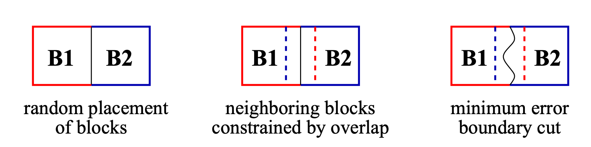

### Random Block Sampling
This is the easiest method of texture synthesis that simply chooses random blocks and just straightforwardly stitches them together.
Usually, stitches are going to be very obvious and won't create a nice pattern.

| Input Texture                                               | Random Block Sampling                                    |
|-------------------------------------------------------------|----------------------------------------------------------|
| 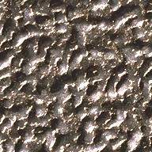 | 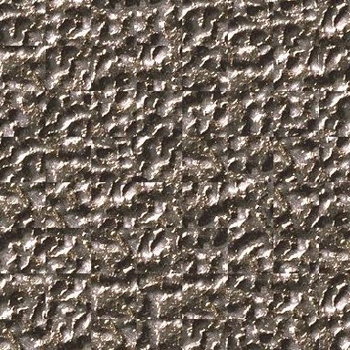 |

### Overlap Sampling & Best Match
In this part, we choose some random block for the top left corner. After that, we are trying to overlap all possible blocks with
the output image with the offset (in our case 1/6 of the block size as was suggested in the paper). We can get 3 different cases for the overlap region depending on the position:
vertical, horizontal, and corner overlaps. For the received overlap region we then calculate the L2 loss function between previously added blocks to the output image and some block
that we are trying to put next to them. After that, we are finding the block with the minimum error, and calculate some threshold depending on this value.
Using this threshold we can randomly select one suitable block that we stitch together with the image in the middle of the overlap region.

| Input Texture                                               | Overlap Sampling & Best Match                             |
|-------------------------------------------------------------|-----------------------------------------------------------|
|  | 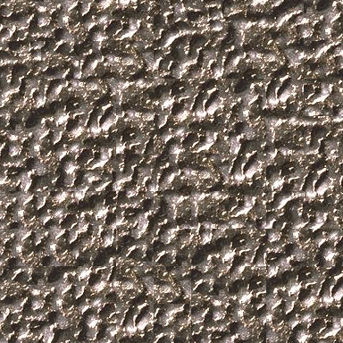 |

### Minimum Error Boundary Cut
For this most advanced algorithm, we are doing all the same steps as for the Overlap Sampling & Best Match, when selecting the most suitable block. The only difference is the
stitching method. In this case, instead of just connecting blocks in the middle of the overlap region, we are finding the best possible path of stitching using dynamic programming.

| Input Texture                                               | Minimum Error Boundary Cut                               |
|-------------------------------------------------------------|----------------------------------------------------------|
|  | 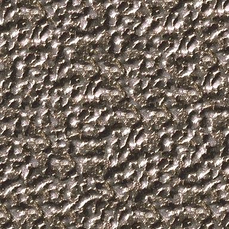 |

### More examples of our results

| Input Texture                                               | Minimum Error Boundary Cut                             | Input Texture                                               | Minimum Error Boundary Cut                               |
|-------------------------------------------------------------|--------------------------------------------------------|-------------------------------------------------------------|----------------------------------------------------------|
| 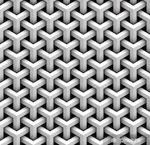 | 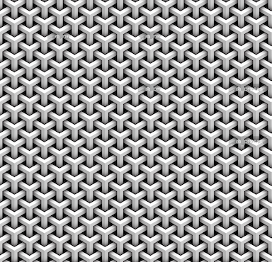 | 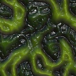 | 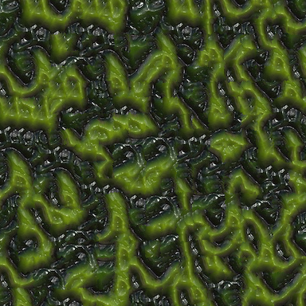  |
| 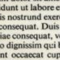 | 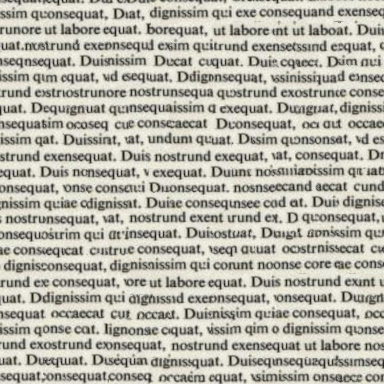 | 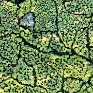 | 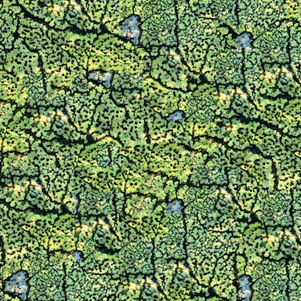 |

## Validation

## Performance

## Benchmark alternatives

## Bottlenecks

## Optimization plan

