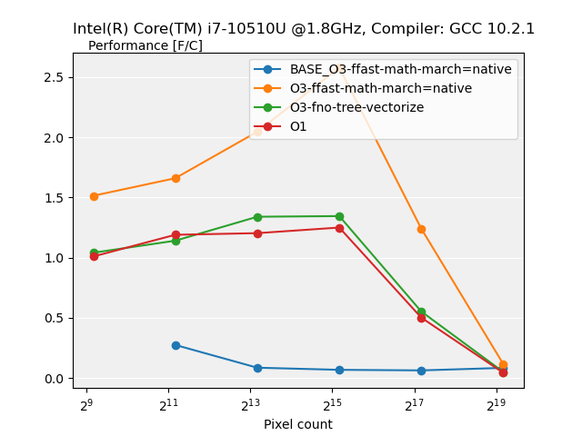
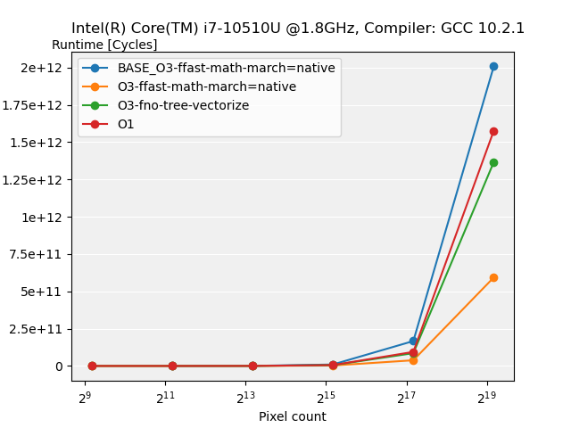
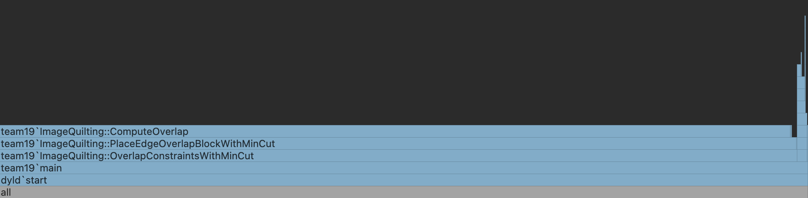
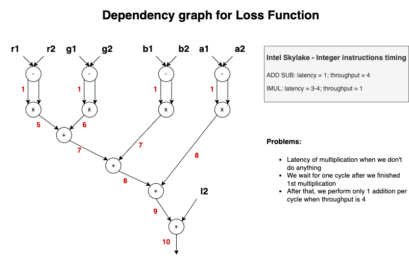
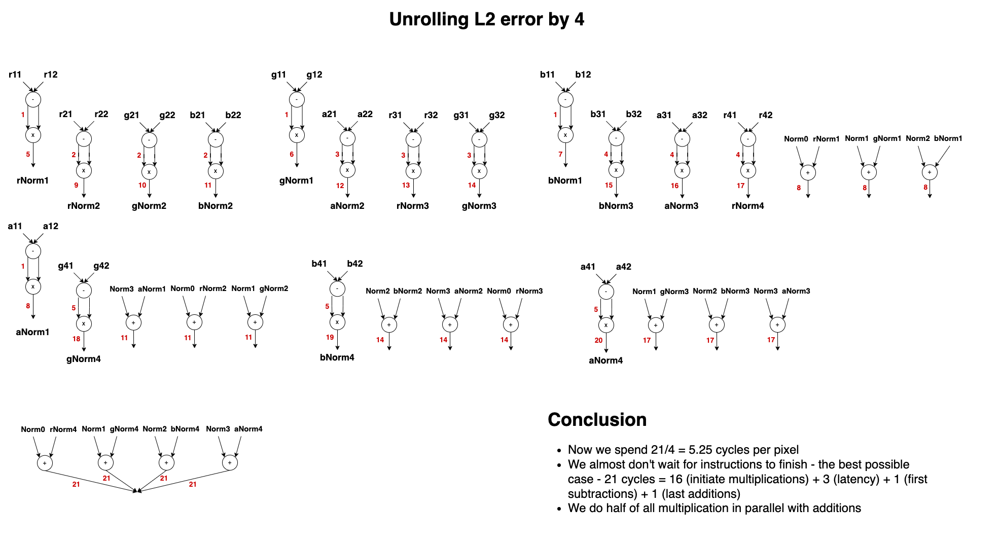
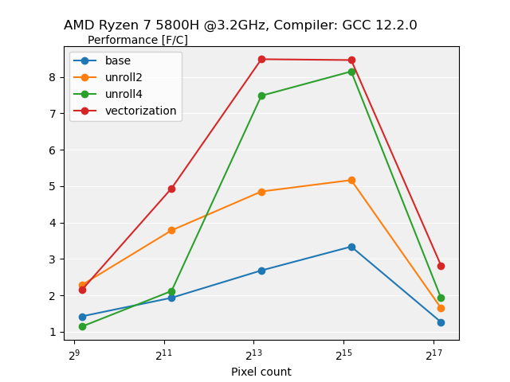
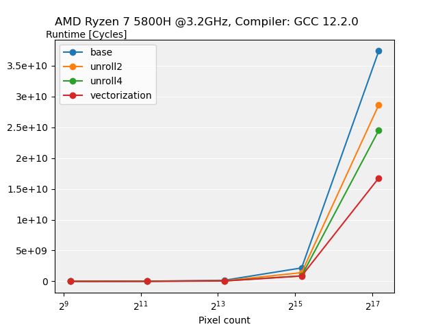

# Image Quilting

Image Quilting is a method for stitching sampled patches from a texture image to create bigger textures. The algorithm samples blocks from the original texture and iteratively tries to stitch them together until the larger image has been generated.

The algorithm is described in http://graphics.cs.cmu.edu/people/efros/research/quilting/quilting.pdf, chapter 2 (Quilting), page 2.

This project is done in collaboration with Tal Rastopchin (@trastopchin) and Svitlana Morkva (@SvetaMorkva) in scope of Advanced Systems Laboratory course in ETH Zurich.

## Basic Implementation

Our implementation was written from scratch based on the original paper. We implemented our algorithm by expanding from the most naive method - Random Block Sampling, 
to more advanced ones - Overlap Sampling & Best Match, and finally to the Minimum Error Boundary Cut. 


### Random Block Sampling
This is the easiest method of texture synthesis that simply chooses random blocks and just straightforwardly stitches them together.
Usually, stitches are going to be very obvious and won't create a nice pattern.

| Input Texture                                               | Random Block Sampling                                    |
|-------------------------------------------------------------|----------------------------------------------------------|
|  |  |

### Overlap Sampling & Best Match
In this part, we choose some random block for the top left corner. After that, we are trying to overlap all possible blocks with
the output image with the offset (in our case 1/6 of the block size as was suggested in the paper). We can get 3 different cases for the overlap region depending on the position:
vertical, horizontal, and corner overlaps. For the received overlap region we then calculate the L2 loss function between previously added blocks to the output image and some block
that we are trying to put next to them. After that, we are finding the block with the minimum error, and calculate some threshold depending on this value.
Using this threshold we can randomly select one suitable block that we stitch together with the image in the middle of the overlap region.

| Input Texture                                               | Overlap Sampling & Best Match                             |
|-------------------------------------------------------------|-----------------------------------------------------------|
|  |  |

### Minimum Error Boundary Cut
For this most advanced algorithm, we are doing all the same steps as for the Overlap Sampling & Best Match, when selecting the most suitable block. The only difference is the
stitching method. In this case, instead of just connecting blocks in the middle of the overlap region, we are finding the best possible path of stitching using dynamic programming.

| Input Texture                                               | Minimum Error Boundary Cut                               |
|-------------------------------------------------------------|----------------------------------------------------------|
|  |  |

### More examples of our results


| Input Texture                                               | Minimum Error Boundary Cut                             | Input Texture                                               | Minimum Error Boundary Cut                               |
|-------------------------------------------------------------|--------------------------------------------------------|-------------------------------------------------------------|----------------------------------------------------------|
|  |  |  |   |
|  |  |  |  |


## Validation
To validate the results during the optimization phase, we created the wrapper around our implementation. There we can register new functions with our optimizations. This testing framework then will generate output images for all test input files using our base implementation. We set seed to some specific value, to remove all randomization that our algorithm has, so it is going to give us the same result every time. After that, the program will run the same test dataset with our new registered function and will estimate the error between results with base and optimized implementation. Right now, our testing tool returns zero error when comparing results that both were generated with base implementation, as expected.

To illustrate how it works, here is the terminal output after running our algorithm with a seed of 0 on our set of 6 input files.
```
Input files:
"./testing/input/4.png"
"./testing/input/5.png"
"./testing/input/2.png"
"./testing/input/3.png"
"./testing/input/1.png"
"./testing/input/0.png"
Output files:
./testing/output/4.png
./testing/output/5.png
./testing/output/2.png
./testing/output/3.png
./testing/output/1.png
./testing/output/0.png
```
Here is the terminal output after running our algorithm with a seed of 0 using the same algorithm as a test function.
```
Input files:
"./testing/input/4.png"
"./testing/input/5.png"
"./testing/input/2.png"
"./testing/input/3.png"
"./testing/input/1.png"
"./testing/input/0.png"
Registered function: default
Testing function: default
"./testing/input/4.png", error: 0
"./testing/input/5.png", error: 0
"./testing/input/2.png", error: 0
"./testing/input/3.png", error: 0
"./testing/input/1.png", error: 0
"./testing/input/0.png", error: 0
default is correct
```
The error of 0 means that the registered test function produced the exact same result as our baseline implementation. If, for example, I set the seed value to be 1, and then run the test function again, I get the following output.
```
Input files:
"./testing/input/4.png"
"./testing/input/5.png"
"./testing/input/2.png"
"./testing/input/3.png"
"./testing/input/1.png"
"./testing/input/0.png"
Registered function: default
Testing function: default
"./testing/input/4.png", error: 43231.6
default is incorrect
```
## Performance
To measure performance we chose the cost metric of flops/cycle. To count flops we derived general formula for each block, as we iterate through blocks variable will update the total count of flops.
The cycles are measured using TSC counter, which is available on all x86 machines. Performance measurement involves 2 steps:

1. Warm-up phase: used to warm-up the cache and determine the correct amount of runs to avoid inconsistent results.

2. Actual measurement: run algorithm several times and count flops and cycles.

We ran performance measurements for different compiler flags: -O3 -ffast-math -march=native; -O3 -fno-tree-vectorize; -O1 and included the results:

| Performance Plot [Flops/Cycle]                                        | Runtime Plot [Cycles]                                             |
|-----------------------------------------------------------------------|-------------------------------------------------------------------|
|  |  |

## Benchmark alternatives

We benchmark the code found at: https://github.com/AirGuanZ/ImageQuilting

In order to do a performance analysis on this code, simply run `./write_result` in the `src/benchmarking/other_implementation` directory. 

This will write the benchmark to the file:

```results/timing_results_other_implementation_-O3-ffast-math-march=native.txt```

We can then regenerate a performance plot by running:

```python3 src/benchmarking/performance_plot.py```

And a runtime plot by running:

```python3 src/benchmarking/runtime_plot.py```

## Bottlenecks
The major bottleneck in our code is the ComputeOverlap function that estimates the L2 loss function for all possible blocks in all possible 
positions. By performing profiling analysis with DTrace tool, we can see that ComputeOverlap takes ~85% of all algorithm computations.



## Optimization plan

### Simple
1. Pre-calculation of indices and bounds.
2. Everything is a c-style array except for the one structure holding all the algorithm's relevant information; we can get rid of all the indirection with the struct references.
3. Basic block optimization: loop unrolling with scalar replacement and optimization of dependencies / ILP for computing the overlap error and in computing the minimum cuts. We will apply these optimizations to the following three intensive functions:
   * ComputeOverlap (Svitlana, Ivan).
   * PlaceEdgeOverlapBlockWithMinCut (TBD).

#### WriteBlockOverlapWithMinCut (Tal, Baptiste)
We applied index precomputation. We choose to unroll the computation for the error surfaces because the computation for each channel and the computation for each pair of pixels is independant. For computing the error surfaces, we fully unrolled the color channel k loop, and we unrolled the column loop j by 2. We did not choose to unroll the dynamic programming computations because there is no path parallelism.

We found that these three optimizations made no noticeable impact on the runtime of the entire algorithm. This makes sense, since our first flame graph illustrated that calls to the `WriteBlockOverlapWithMinCut` function take up 3% of the algorithm's runtime whereas calls to the `ComputeOverlap` function take up to 85% of the algorithm's runtime. As a sanity check, we timed the individual function on random input data, and we found that we only got around a 1.2 time speedup; we expected it to be more, but we moved on for now since it is not important to the runtime of the overall algorithm.

### Advanced
1. Divide functions into 2 types, with and without bound checks. (Svitlana, Ivan).
2. For some blocks that were chosen from the beginning of the input texture we can estimate for sure the block next to it that will have zero error in the overlap region (it's going to be the block next to the previously chosen one on the input image). So there is no need to calculate the loss function for all blocks and the min-cut, we just need to find a starting position for the new block and straightforwardly stitch them together. (?)
3. In the second stage of the algorithm, we compute the error between one block of the output texture and every block of the input texture. We have spatial locality because we access the matrices row-by-row, but more importantly, we re-use the entire block of the output texture to compute the error multiple times. This suggests that we should create a blocked version of the function so that we can keep some region of the output texture entirely in cache and reduce the number of cache misses. Auto-tuning infrastructure for block sizes. (Tal, Baptiste).
4. In order to compute the horizontal minimum cut, our dynamic programming traverses the overlap region column by column, which means that we don't have spatial locality. (Svitlana, Ivan).
5. Vectorization of L2 loss function calculation. (Svitlana, Ivan).

## Instruction-Level Parallelism
The most common calculation in this algorithm is the computation of the L2 error function between different overlap regions.
It repeats all over the algorithm and is the key part of our bottleneck function - ComputeOverlap. As this computation is so
common and has a high dependency on previous computations, it is crucial to unroll this for loop with many accumulators to ensure
that we won't wait unnecessary time till computations are finished.

We have 4 independent subtractions, 4 multiplication, and 4 final additions per iteration. We can perform adds/subs on 4 ports, and mults only on 1 of these 4 ports. So multiplication is going to be the bottleneck of the computation. Without taking into account dependencies, the best runtime per iteration: max(4 {1 mult per cycle}, 8/3 {3 adds/subs per cycle}) = 4 cycles per pixel if we won't wait for any computations to finish. Here is the dependency graph:

<p align="center">
   
</p>

Because of the dependencies we need more that twice more time per iteration. The most important part is to improve efficiency during multiplications - also use other ports to perform additions. Because we have twice as many additions as multiplication, but also the throughput of additions is bigger by 4, the best that we can hope for is to parallelize a bit more than half of all multiplications. We can parallelize half of the multiplication with stride equal to 4: first pixel channels multiplication are parallel with subtractions; last pixel channels multiplication are parallel with final additions:

<p align="center">
   
</p>

Even though this is the best option in theory (with stride=2 runtime is 6.5 cycles per pixel), it's not the best one in practice, probably because we already have too many accumulators. 

## Vectorisation 

To vectorize ComputeOverlap function we used different intrinsics that operate on 16-bit integers. In each iteration we load 16 unsigned chars 
into m128i vector and convert it to m256i 16-bit integer to avoid overflow during subtraction and multiplication, that means that we have unroll 
by 4.  We also calculated latency for each intrinsic and reordered them to minimize wait time .
All timing was done with max possible compile flag optimizations (-O3-ffast-math-march=native).

| Performance Plot [Flops/Cycle]                                                | Runtime Plot [Cycles]                                                        |
|-------------------------------------------------------------------------------|------------------------------------------------------------------------------|
|  |  |


Room to expand: vectorize computing of square root by storing raw values of L2 loss function and then compute roots in vector form.

## Blocking (Tal)

The image quilting algorithm chooses a new block by minimizing the overlap L2 norm between the generated output and every potential block from the input image. While computing the overlap between the output and input overlap regions, there is no re-use since the pixel-pixel differences are computed exactly once. So there would be no benefit from blocking the individual overlap L2 norm computation. However, because the output overlap region is compared to every potential input overlap region, we could block the L2 norm computation so that the entire output overlap region remains in cache.

Let us assume that our blocks are square. We have that overlap width is 1/6 of the block width. Because most of the overlap regions are of the corner type, we have that the most common overlap region contains 2 w^2/6 + w^2/36 = 13/16 w^2 pixels. Our image is represented as an array of unsigned chars, each pixel has four color channels, and an unsigned char is one byte. Hence, the most common overlap region contains 4 * 13/36 w^2 = 13/9 w^2 bytes.

The image quilting algorithm iteratively compares the output region to the input region, which means that 2 * 13/9 w^2 = 26/9 w^2 bytes would need to fit into cache to minimize the number of cache misses. In the case of my Intel Core i7, which has an L1 cache size of 64KiB, the block width would have to be about 150 pixels to fully fill the cache. This means that if we block the overall algorithm, we expect a theoretical performance increase when the block width is greater than 150 pixels. However, in practice, this is not the case. Reordering the loops so that the computation iterates over each pixel of the overlap region exactly once immediately slows down the runtime by a factor of 3. Implementing the blocking after reordering the loops did not change the run time at all, regardless of the block size that we gave it.

Questions:
* Is our analysis of how much memory the overlap regions require correct? I did not include the array of errors, but it feels like I should still see a performance for large block sizes, and that's not the case.
* Why does reordering the loops cause such a runtime increase across different block sizes?
* How can we make sure that our blocking implementation actually is doing what we would like it to do? That is, should we manually inline all of the blocking helper function calls? Should the blocking sizes be #defined so they are determined at run time?

## Questions
1. We have a lot of integer computations that can be vectorized nicely. For now, we change pixels values to double to 
calculate the performance using flops, but maybe we will need to choose another metric (calculating int ops too?) for the 
performance calculation in the future?
2. For blocking the error computation, what should the parameters for the block size be here? Should we use a generator?
